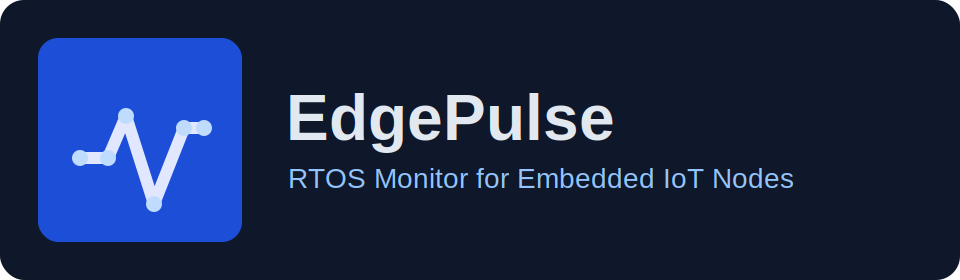
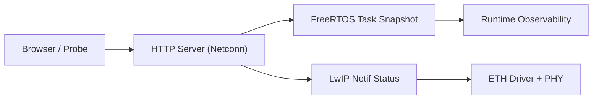

# 边缘脉冲实时监控站 EdgePulse RTOS Monitor

<p align="center">
  
</p>

🔥 基于 `STM32F746ZG + FreeRTOS + LwIP` 的嵌入式 Web 监控固件。  
🚀 提供轻量 HTTP 服务、RTOS 任务运行态可视化、设备状态 JSON 接口。  
⭐ 面向 IoT 网关/边缘节点调试场景，支持快速二开与工程化发布。

<p align="center">
  
  
  
  
  
</p>

---

## 目录

- [1. 项目定位](#1-项目定位)
- [2. 功能概览](#2-功能概览)
- [3. 架构说明](#3-架构说明)
- [4. 目录结构](#4-目录结构)
- [5. 快速开始](#5-快速开始)
- [6. 配置说明](#6-配置说明)
- [7. HTTP 接口与页面](#7-http-接口与页面)
- [8. 与基础示例的差异](#8-与基础示例的差异)
- [9. 二次开发建议](#9-二次开发建议)
- [10. 许可与声明](#10-许可与声明)

---

## 1. 项目定位

`EdgePulse RTOS Monitor` 是一个面向嵌入式设备可观测性的固件项目，核心目标是：

- 在 MCU 端直接暴露可访问的 Web 控制台
- 实时展示 FreeRTOS 任务运行状态
- 提供可被上层系统采集的状态 API
- 为 IoT 边缘节点场景提供可维护的最小后端能力

该仓库适合作为：

- STM32 + FreeRTOS + LwIP 联调模板
- 嵌入式 Web 服务课程设计/项目实战基座
- 边缘设备监控面板的起步工程

---

## 2. 功能概览

### 2.1 当前已实现能力

- HTTP 服务端（默认端口 `80`）
- 首页仪表板（中文+英文说明）
- 任务监控页（自动刷新）
- 状态接口 `GET /api/status`（JSON）
- DHCP/静态 IP 双模式网络配置
- 统一配置头文件管理（网络参数 + 外部服务占位配置）

### 2.2 典型调试视角

- **网络是否连通**：查看 `link_up/netif_up/ip`
- **任务是否卡死**：查看任务页状态与栈余量
- **服务是否存活**：轮询 `GET /api/status`

---

## 3. 架构说明



核心流程：

1. `main.c` 启动 TCP/IP 栈与网络接口。
2. `httpserver-netconn.c` 监听 HTTP 请求并路由。
3. `/tasks` 调用 `osThreadList()` 输出任务运行态。
4. `/api/status` 输出设备运行指标（请求计数、链路、IP、uptime）。

---

## 4. 目录结构

```text
.
├── Core
│   ├── Inc
│   │   ├── edgepulse_config.h      # 统一配置入口
│   │   ├── main.h
│   │   ├── httpserver-netconn.h
│   │   └── ...
│   └── Src
│       ├── main.c
│       ├── app_ethernet.c
│       ├── ethernetif.c
│       ├── httpserver-netconn.c    # 路由、页面、API
│       └── ...
├── Drivers
├── Middlewares
│   ├── FreeRTOS
│   └── LwIP
├── Makefile
├── LICENSE
└── THIRD_PARTY_NOTICES.md
```

---

## 5. 快速开始

### 5.1 环境准备

- `arm-none-eabi-gcc` 工具链
- `make`
- `OpenOCD`（用于烧录）
- 开发板：`NUCLEO-F746ZG`

### 5.2 编译

```bash
make
```

产物默认在 `build/` 目录下。

### 5.3 烧录

```bash
make flash
```

### 5.4 访问

设备联网后，在浏览器访问：

- `http://<board-ip>/`
- `http://<board-ip>/tasks`
- `http://<board-ip>/api/status`

---

## 6. 配置说明

统一配置文件：`Core/Inc/edgepulse_config.h`

### 6.1 网络模式

- `EDGE_USE_DHCP = 1`：启用 DHCP
- `EDGE_USE_DHCP = 0`：启用静态 IP

静态网络参数：

- `EDGE_STATIC_IP0..3`
- `EDGE_NETMASK0..3`
- `EDGE_GATEWAY0..3`

### 6.2 外部服务占位配置

可在同一文件设置：

- `EDGE_DB_HOST / EDGE_DB_PORT`
- `EDGE_REDIS_HOST / EDGE_REDIS_PORT`
- `EDGE_OLLAMA_API_URL`
- `EDGE_TELEMETRY_API_URL`

说明：这些字段用于后续扩展（上报/缓存/推理接入）时统一管理，当前基础固件不强依赖。

---

## 7. HTTP 接口与页面

### 7.1 页面路由

- `GET /`：首页（设备与能力概览）
- `GET /tasks`：任务运行态监控页（自动刷新）

### 7.2 API 路由

- `GET /api/status`

示例返回：

```json
{
  "project": "EdgePulse RTOS Monitor",
  "role": "iot-gateway",
  "request_count": 42,
  "tasks_page_hits": 10,
  "link_up": true,
  "netif_up": true,
  "ip": "192.168.10.40",
  "uptime_ms": 123456
}
```

---

## 8. 与基础示例的差异

本仓库已经从“原始演示工程”升级为“可维护的项目骨架”，包括：

- 由二进制页面切换为可读字符串页面与路由处理
- 增加统一配置中心 `edgepulse_config.h`
- 增加 JSON 状态接口，便于系统集成
- 页面文案与结构重构为工程化展示
- 编译目标名称调整为 `EdgePulseMonitor`
- 增加多许可证说明文档，明确可发布边界

---

## 9. 二次开发建议

推荐优先级：

1. 增加 `/api/tasks` 结构化输出，便于前端绘图。
2. 引入 MQTT/HTTP 上报任务，形成云边协同链路。
3. 增加设备健康检查指标（heap、stack watermark、queue depth）。
4. 接入认证/白名单机制，避免局域网内裸露管理页。
5. 抽象 `http_route_*` 模块，降低单文件复杂度。

---

## 10. 许可与声明

本仓库包含多来源组件，使用时请遵循各自许可证：

- ST 相关源码与头文件：遵循原文件头部声明
- FreeRTOS：遵循其官方许可证
- LwIP：遵循其官方许可证
- 本仓库新增的文档与自定义整合代码：见仓库根目录 `LICENSE`

详细清单见：`THIRD_PARTY_NOTICES.md`

## Baseline Maintenance

### Environment

- Put runtime credentials in environment variables.
- Use `.env.example` as the configuration template.

### CI

- `baseline-ci.yml` provides a unified pipeline with `lint + build + test + secret scan`.

### Repo Hygiene

- Keep generated files (`dist/`, `build/`, `__pycache__/`, `.idea/`, `.DS_Store`) out of version control.

